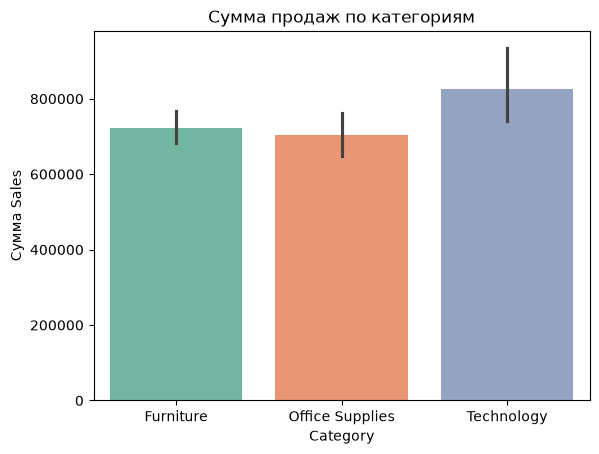
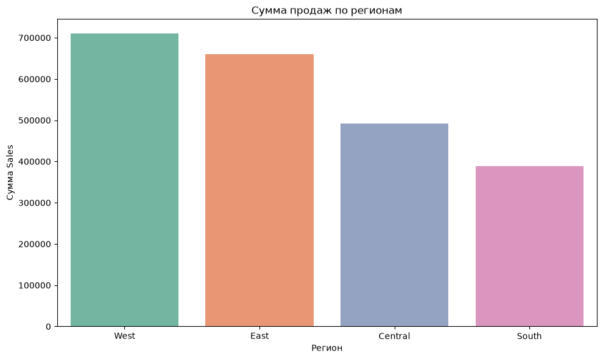
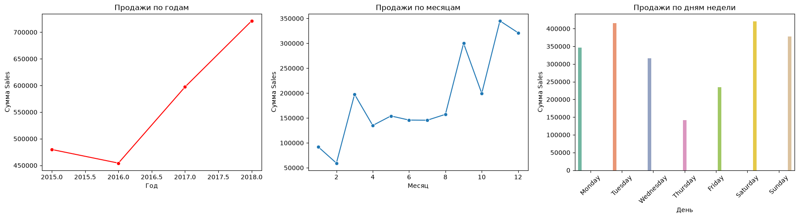
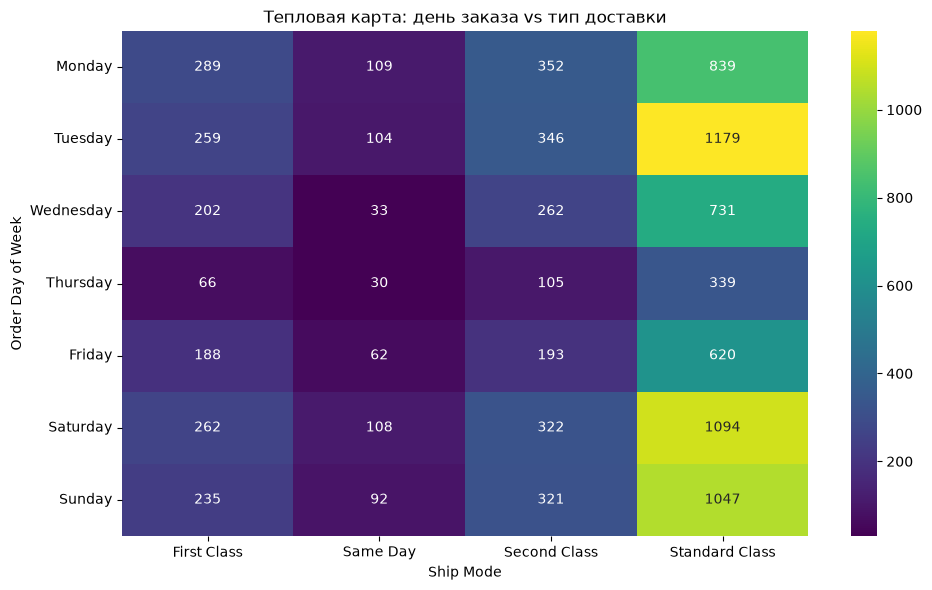

# Superstore Sales Analysis

Анализ продаж розничной сети Superstore за 2015–2018 годы.

**Цель:** выявить самые прибыльные категории, регионы и сегменты, а также понять, как сезонность и доставка влияют на продажи.

## Данные

- **Источник:** Kaggle, Superstore Sales Dataset
- **Файл:** `data/raw/superstore.csv`
- **Размер:** 9800 строк, 18 столбцов
- **Период:** 2015–2018

## Стек

- Python 3.x
- pandas, numpy
- matplotlib, seaborn
- scipy
- jupyter

## Ключевые выводы

1. **Technology** - лидер по сумме продаж (825 856) и среднему чеку (456).
2. **West** - лидер по выручке (710 000). **South** - аутсайдер (390 000).
3. **Consumer** - лидер по количеству заказов.
4. **Сезонность** видна визуально (сентябрь–декабрь), но статистически не подтверждена.
5. **Тип доставки** зависит от дня недели и региона.

## Бизнес-рекомендации

1. Фокус на Technology.
2. Развитие South и Home Office.
3. Оптимизация доставки в понедельник и четверг.
4. Стимулирование First Class в Central и South.
5. Увеличение запасов в сентябре–декабре.

## Гипотезы

| № | Гипотеза | Тест | Результат |
|---|----------|------|-----------|
| 1 | Technology > Furniture по среднему чеку | t-тест Уэлча | Значимо |
| 2 | Продажи различаются по регионам | ANOVA | Не значимо |
| 3 | Сегмент связан с категорией | χ² | Не значимо |
| 4 | День заказа связан с типом доставки | χ² | Значимо |
| 5 | Тип доставки связан с регионом | χ² | Значимо |
| 6 | Сегмент связан со средним чеком | ANOVA | Не значимо |
| 7 | Категория связана с месяцем заказа | χ² | Не значимо |

## Примеры графиков

## Ограничения

Анализ не учитывает Profit и Discount, так как эти поля отсутствуют в датасете.

## Автор

**Дмитриев Ярослав**
- GitHub: [dmitriev-yaroslav](https://github.com/dmitriev-yaroslav)
